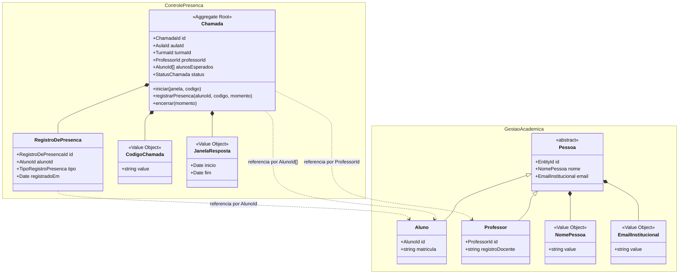

# Trabalho — Design Tático no DDD

Implementação em TypeScript do domínio **Controle de Presença**, usando Entidades, Value Objects, Aggregate Root, Repositório, Eventos de Domínio e invariantes de negócio. O projeto também inclui uma pequena modelagem do contexto **Gestão Acadêmica** para representar `Pessoa`, `Aluno` e `Professor`.


## 🧩 2) Entidades vs Value Objects

| Elemento | Tipo | Por quê? |
|---|---|---|
| `Pessoa` | Entidade abstrata | Possui identidade e concentra dados comuns de pessoas, como nome e e-mail. |
| `Aluno` | Entidade | É uma pessoa com matrícula acadêmica. |
| `Professor` | Entidade | É uma pessoa com registro docente. |
| `Chamada` | Entidade / Aggregate Root | Possui identidade própria e ciclo de vida: planejada, aberta e encerrada. |
| `RegistroDePresenca` | Entidade interna | Possui identidade própria dentro da chamada e representa o registro individual de um aluno. |
| `CodigoChamada` | Value Object | É imutável e validado pelo valor, com 6 caracteres alfanuméricos. |
| `JanelaResposta` | Value Object | Representa início e fim do período de resposta, com igualdade por valor. |
| `NomePessoa` | Value Object | Representa um nome validado e comparado por valor. |
| `EmailInstitucional` | Value Object | Representa um e-mail validado e comparado por valor. |
| `AlunoId`, `ProfessorId`, `TurmaId`, `AulaId` | Value Object | São identificadores semânticos usados para referenciar outros agregados por ID. |

`Aluno` e `Professor` herdam de `Pessoa` porque compartilham dados comuns. Mesmo assim, eles não ficam dentro do agregado `Chamada`; a chamada mantém apenas `AlunoId` e `ProfessorId`.

## 🏗️ 3) Agregados e Aggregate Root (AR)

**Agregado Principal:** `Chamada`

**Conteúdo interno do agregado:**

- `RegistroDePresenca`
- `CodigoChamada`
- `JanelaResposta`
- `StatusChamada`

**Referências a outros agregados por ID:**

- `AulaId`
- `TurmaId`
- `ProfessorId`
- `AlunoId`

O agregado `Chamada` não contém objetos completos de aluno, professor, turma ou aula. Ele guarda apenas os IDs, porque esses conceitos pertencem ao contexto de Gestão Acadêmica.

**Contexto Gestão Acadêmica:**

```text
Pessoa
├── Aluno
└── Professor
```

`Pessoa` é uma entidade abstrata usada para compartilhar atributos comuns. `Aluno` e `Professor` são entidades diferentes porque possuem papéis e dados específicos no domínio acadêmico.

## 🧭 4) Invariantes e Máquina de Estados

**Invariantes:**

- Uma chamada precisa ter pelo menos um aluno esperado.
- Apenas chamadas planejadas podem ser iniciadas.
- Presença só pode ser registrada quando a chamada está aberta.
- O código informado pelo aluno deve ser igual ao código da chamada.
- O registro deve acontecer dentro da janela de resposta.
- O aluno precisa pertencer à turma da chamada.
- Um aluno não pode ter dois registros na mesma chamada.
- Ao encerrar a chamada, alunos sem presença recebem falta automaticamente.
- Chamada encerrada não pode receber novos registros.

**Estados e transições da AR `Chamada`:**

```text
Planejada -> Aberta -> Encerrada

Regras:
- Planejada -> Aberta: permitido quando a janela de resposta é válida.
- Aberta -> Aberta: permitido ao registrar presença dentro da janela e com código correto.
- Aberta -> Encerrada: gera falta para alunos sem registro.
- Encerrada -> Aberta: bloqueado.
- Encerrada -> RegistrarPresenca: bloqueado.
```

## 🗃️ 5) Repositório do Agregado (interface)

O repositório trabalha apenas com a Aggregate Root `Chamada`.

```ts
export interface ChamadaRepository {
  obterPorId(id: ChamadaId): Promise<Chamada | null>;
  adicionar(chamada: Chamada): Promise<void>;
  salvar(chamada: Chamada): Promise<void>;
}
```

Implementação criada:

- `src/presenca/domain/repositories/ChamadaRepository.ts`
- `src/presenca/infrastructure/InMemoryChamadaRepository.ts`

## 📣 6) Eventos de Domínio

| Evento | Quando ocorre | Payload mínimo | Interno/Integração | Observações |
|---|---|---|---|---|
| ChamadaCriada | Ao criar uma chamada planejada | chamadaId, aulaId, turmaId | Interno | Pode alimentar histórico da aula. |
| ChamadaIniciada | Ao abrir a chamada | chamadaId, código, início, fim | Interno | Define o período em que alunos podem responder. |
| PresencaRegistrada | Quando um aluno registra presença | chamadaId, alunoId, registradoEm | Integração | Pode ser consumido por frequência e relatórios. |
| FaltaRegistrada | Ao encerrar chamada com aluno ausente | chamadaId, alunoId, registradoEm | Integração | Pode ser consumido pelo acompanhamento de frequência. |
| ChamadaEncerrada | Quando a chamada é finalizada | chamadaId, totalPresentes, totalFaltas | Integração | Pode disparar relatórios e atualização de frequência. |


## 🗺️ 8) Diagrama



